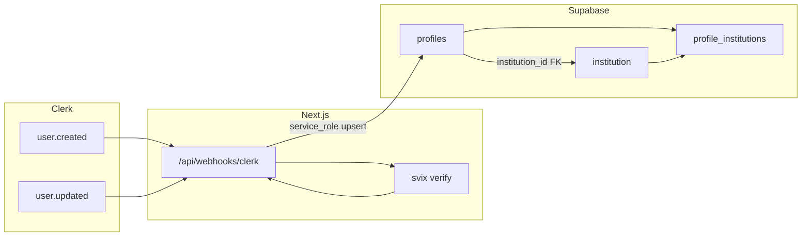

# Clerk–Supabase sync and SQL schema plan

## 1. SQL schema (PostgreSQL for Supabase)

Clerk user IDs are **strings** (e.g. `user_2abc...`), not UUIDs. Two options:

- **Option A (recommended):** Use `id TEXT` as primary key and store the Clerk user ID in `id`. No extra column; RLS and webhook use this directly.
- **Option B:** Use `id UUID` and add `clerk_id TEXT UNIQUE NOT NULL` so “matches Clerk’s User ID” is the `clerk_id` column.

The plan below uses **Option A**. If you prefer Option B, we can switch `profiles.id` to UUID and add `clerk_id` and adjust RLS accordingly.

### 1.1 `requesting_user_id()` (for RLS)

Required so RLS can compare the current user to row data. Supabase will read the JWT `sub` claim (Clerk user ID) from the token issued by Clerk’s Supabase JWT template.

```sql
CREATE OR REPLACE FUNCTION requesting_user_id()
RETURNS text
LANGUAGE sql
STABLE
AS $$
  SELECT NULLIF(
    current_setting('request.jwt.claims', true)::json->>'sub',
    ''
  )::text;
$$;
```

You must create a **Supabase JWT template** in the Clerk Dashboard (JWT Templates → New → Supabase), add your Supabase **JWT Secret** as the signing key, and name the template `supabase` so client code can use `getToken({ template: 'supabase' })`. See [Supabase + Clerk docs](https://supabase.com/partners/integrations/clerk).

### 1.2 `institution` table

```sql
CREATE TABLE institution (
  id            uuid PRIMARY KEY DEFAULT gen_random_uuid(),
  name          text,
  institution_type text,
  attributes    jsonb DEFAULT '{}',
  created_at    timestamptz DEFAULT now()
);
```

- `attributes` (JSONB): for future institution fields without schema changes.

### 1.3 `profiles` table

```sql
CREATE TABLE profiles (
  id             text PRIMARY KEY,                    -- Clerk user ID (e.g. user_2xxx)
  email          text NOT NULL,
  first_name     text,
  last_name      text,
  user_type      text NOT NULL DEFAULT 'individual',
  institution_id uuid REFERENCES institution(id),     -- optional “primary” institution
  attributes     jsonb DEFAULT '{}',                  -- future profile fields
  created_at     timestamptz DEFAULT now(),
  updated_at     timestamptz DEFAULT now()
);

CREATE INDEX idx_profiles_institution_id ON profiles(institution_id);
```

- `id`: Clerk user ID (Option A). Use this in RLS and in the webhook when upserting.
- `attributes`: JSONB for future profile attributes.

### 1.4 Many-to-many: `profile_institutions`

```sql
CREATE TABLE profile_institutions (
  profile_id     text NOT NULL REFERENCES profiles(id) ON DELETE CASCADE,
  institution_id uuid NOT NULL REFERENCES institution(id) ON DELETE CASCADE,
  created_at     timestamptz DEFAULT now(),
  PRIMARY KEY (profile_id, institution_id)
);

CREATE INDEX idx_profile_institutions_profile ON profile_institutions(profile_id);
CREATE INDEX idx_profile_institutions_institution ON profile_institutions(institution_id);
```

- `profile_id`: same type as `profiles.id` (text).
- Optional: add `role` or `attributes` jsonb later if needed.

### 1.5 Optional `updated_at` trigger (profiles)

```sql
CREATE OR REPLACE FUNCTION set_updated_at()
RETURNS trigger LANGUAGE plpgsql AS $$
BEGIN
  NEW.updated_at = now();
  RETURN NEW;
END;
$$;

CREATE TRIGGER profiles_updated_at
  BEFORE UPDATE ON profiles
  FOR EACH ROW EXECUTE FUNCTION set_updated_at();
```

---

## 2. Row Level Security (RLS)

### 2.1 Enable RLS and policies on `profiles`

- Enable RLS: `ALTER TABLE profiles ENABLE ROW LEVEL SECURITY;`
- **SELECT:** user can read their own row: `requesting_user_id() = id`
- **UPDATE:** user can update their own row: `requesting_user_id() = id`
- **INSERT:** not allowed from the app (profiles are created/updated only via webhook using the service role). So no INSERT policy for `authenticated`; the webhook uses the **service role** client, which bypasses RLS.

Policies (target role `authenticated`):

- `profiles_select_own`: `USING (requesting_user_id() = id)`
- `profiles_update_own`: `USING (requesting_user_id() = id)` and `WITH CHECK (requesting_user_id() = id)`

No INSERT for `authenticated` so that only the webhook (service role) can create profiles.

### 2.2 Enable RLS on `institution`

- **SELECT:** allow authenticated users to read (e.g. for dropdowns or membership checks): `USING (true)` for role `authenticated`.
- **INSERT/UPDATE/DELETE:** typically admin-only; for now you can leave no policies (only service role can write) or add later.

### 2.3 Enable RLS on `profile_institutions`

- **SELECT:** user can see rows where they are the profile: `requesting_user_id() = profile_id`
- **INSERT:** user can add themselves to an institution: `requesting_user_id() = profile_id`
- **DELETE:** user can remove their own membership: `requesting_user_id() = profile_id`
- **UPDATE:** optional; same as DELETE if you only allow “leave” and re-join.

---

## 3. Webhook: sync Clerk → Supabase profiles

Yes, you should implement 4.1–4.4.

### 3.1 Webhook route

- **Path:** [app/api/webhooks/clerk/route.ts](app/api/webhooks/clerk/route.ts) (Next.js 16 App Router).
- **Method:** `POST` only.
- **Behavior:**
  - Read raw body (required for signature verification).
  - Verify signature with **svix** using `CLERK_WEBHOOK_SECRET`.
  - Parse payload and switch on `evt.type`: `user.created`, `user.updated`.
  - From `evt.data`: map Clerk `id` → `profiles.id`, primary email → `email`, `firstName`/`lastName` → `first_name`/`last_name`; optionally set `user_type` from `publicMetadata` (e.g. `individual` / `institution`).
  - Use a **Supabase client created with `SUPABASE_SERVICE_ROLE_KEY`** (server-side only) to `upsert` into `profiles` (on `id`) so both create and update are handled.
- **Response:** 200 with empty body on success; 400 on verification failure; 500 on unexpected errors (log and return generic message).
- **Middleware:** Ensure the webhook path is **not** protected by Clerk auth (e.g. in [middleware.ts](middleware.ts), exclude `/api/webhooks/clerk` so the request is not rejected for missing session).

### 3.2 Library: svix

- Add dependency: `svix` (e.g. `pnpm add svix`).
- Use `Webhook` from `svix` with `CLERK_WEBHOOK_SECRET`; verify the raw body and Svix headers (`svix-id`, `svix-timestamp`, `svix-signature`) before processing. Clerk webhooks are powered by Svix; see [Clerk webhooks](https://clerk.com/docs/reference/webhooks).

### 3.3 Events

- **user.created:** insert or upsert profile (upsert is simpler and idempotent).
- **user.updated:** upsert profile so name/email/metadata changes are reflected.

Optional: handle `user.deleted` to soft-delete or remove the profile row (and clean up `profile_institutions` if you use CASCADE or explicit delete).

### 3.4 Security and env vars

- **CLERK_WEBHOOK_SECRET:** You already have this in [.env.local](.env.local) (replace `whsec_xxxx` with the real secret from Clerk Dashboard → Webhooks → your endpoint → Signing secret).
- **SUPABASE_SERVICE_ROLE_KEY:** Add this to `.env.local` (and never expose it to the client). Get it from Supabase Dashboard → Project Settings → API → `service_role` key. Use it only in the webhook route to create the admin Supabase client that bypasses RLS.

Summary of env vars for this feature:


| Variable                    | Where                                | Purpose                                     |
| --------------------------- | ------------------------------------ | ------------------------------------------- |
| `CLERK_WEBHOOK_SECRET`      | `.env.local` (and prod)              | Verify Clerk webhook signature (svix)       |
| `SUPABASE_SERVICE_ROLE_KEY` | `.env.local` (and prod), server-only | Webhook upserts to `profiles` bypassing RLS |


Also ensure `NEXT_PUBLIC_SUPABASE_URL` and, for the app’s own Clerk-aware client, the anon key are set (you already have these).

---

## 4. Implementation order

1. **Supabase:** Run the SQL in order: function `requesting_user_id()` → `institution` → `profiles` → `profile_institutions` → trigger → enable RLS and create policies on all three tables.
2. **Clerk:** Create Supabase JWT template named `supabase` with your project’s JWT secret; create a webhook endpoint pointing to `https://<your-domain>/api/webhooks/clerk`, subscribe to `user.created` and `user.updated`, copy the signing secret into `CLERK_WEBHOOK_SECRET`.
3. **App:** Add `svix`, create [app/api/webhooks/clerk/route.ts](app/api/webhooks/clerk/route.ts) with verification and upsert logic, and ensure middleware excludes `/api/webhooks/clerk` from auth.
4. **Env:** Set `SUPABASE_SERVICE_ROLE_KEY` in `.env.local` (and production) and replace `CLERK_WEBHOOK_SECRET` with the real value.

---

## 5. Optional: client Supabase + Clerk

Your existing [app/page.tsx](app/page.tsx) uses `session?.getToken()` without a template. For RLS to work with `requesting_user_id()`, the token sent to Supabase must be the one from the **Supabase JWT template** (e.g. `session?.getToken({ template: 'supabase' })`). If you have not already, switch the client to use that template so `request.jwt.claims` in Supabase contains the Clerk `sub` (user ID). The Supabase+Clerk [integration doc](https://supabase.com/partners/integrations/clerk) uses a custom `fetch` that injects the token from `getToken({ template: 'supabase' })`; your current code uses `accessToken()` — ensure that callback returns the same template token when you need RLS to apply.

---

## 6. Diagram (high-level)




This plan gives you the full SQL (with Option A for `profiles.id`), RLS design, webhook route with svix, and the two required environment variables. If you want to use Option B (UUID `id` + `clerk_id`) or change RLS (e.g. who can insert into `institution`), say how you’d like it and we can adjust the plan.