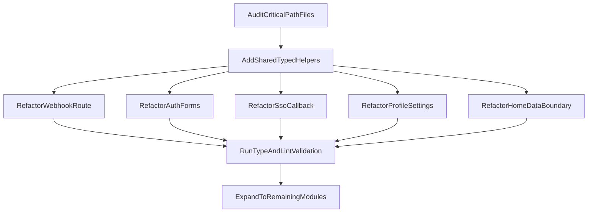

# Production Refactor & Documentation Plan

## Objectives

- Preserve current behavior while improving maintainability and reliability.
- Enforce strict typing and remove unsafe patterns (`any`, broad casts, implicit complex return contracts).
- Separate data-mutation/database logic from UI concerns where currently mixed.
- Add comprehensive JSDoc before every function in scoped files for each phase.

## Phase 1: Critical Path (First Pass)

### 1) Introduce shared safe helpers (non-breaking foundation)

- Add typed error-normalization and guard helpers in shared utilities (`lib/`) and reuse them in auth/webhook/data files.
- Keep output messages equivalent to current UX/API behavior.

Primary files to leverage/update:

- `[/Users/pengfeitian/Documents/Projects/conneco-right-demo/lib/utils.ts](/Users/pengfeitian/Documents/Projects/conneco-right-demo/lib/utils.ts)`
- New focused helper modules in `lib/` only if needed (small, single-purpose).

### 2) Harden webhook server endpoint types and error boundaries

- Refactor webhook handler and helper functions with explicit param/return types and narrowed payload parsing.
- Wrap external integration boundaries (Svix verification, Supabase writes) in explicit try/catch sections with clear error mapping.
- Keep response status behavior unchanged.

Target file:

- `[/Users/pengfeitian/Documents/Projects/conneco-right-demo/app/api/webhooks/clerk/route.ts](/Users/pengfeitian/Documents/Projects/conneco-right-demo/app/api/webhooks/clerk/route.ts)`

### 3) Split auth/account side effects from dense UI orchestration

- Extract repetitive account-mutation logic from large profile settings UI into reusable typed helpers/hooks (client-side orchestration only).
- Retain current UI rendering and user flows while reducing handler complexity.

Target file(s):

- `[/Users/pengfeitian/Documents/Projects/conneco-right-demo/components/profile/settings.tsx](/Users/pengfeitian/Documents/Projects/conneco-right-demo/components/profile/settings.tsx)`
- Potential supporting extraction under `[/Users/pengfeitian/Documents/Projects/conneco-right-demo/components/profile/](/Users/pengfeitian/Documents/Projects/conneco-right-demo/components/profile/)`

### 4) Refactor SSO callback flow into typed decision helpers

- Isolate branching/auth-finalization logic into small typed functions to reduce nested control flow.
- Add robust top-level error handling for async callback flow and keep redirect outcomes equivalent.

Target file:

- `[/Users/pengfeitian/Documents/Projects/conneco-right-demo/app/sso-callback/page.tsx](/Users/pengfeitian/Documents/Projects/conneco-right-demo/app/sso-callback/page.tsx)`

### 5) Standardize sign-in/sign-up logic via shared auth utilities

- Remove repetitive error parsing, redirect handling, and status branching through shared utility/hook usage.
- Add explicit return types to event handlers and API-interaction functions.

Target files:

- `[/Users/pengfeitian/Documents/Projects/conneco-right-demo/components/auth/custom-sign-in-form.tsx](/Users/pengfeitian/Documents/Projects/conneco-right-demo/components/auth/custom-sign-in-form.tsx)`
- `[/Users/pengfeitian/Documents/Projects/conneco-right-demo/components/auth/custom-sign-up-form.tsx](/Users/pengfeitian/Documents/Projects/conneco-right-demo/components/auth/custom-sign-up-form.tsx)`
- `[/Users/pengfeitian/Documents/Projects/conneco-right-demo/components/auth/social-auth-buttons.tsx](/Users/pengfeitian/Documents/Projects/conneco-right-demo/components/auth/social-auth-buttons.tsx)`

### 6) Separate demo/home UI from direct DB operations

- Move Supabase operation logic from page component-level handlers into reusable typed server/data helpers where applicable while preserving displayed behavior.
- Replace weak state typing with explicit row interfaces.

Target file:

- `[/Users/pengfeitian/Documents/Projects/conneco-right-demo/app/page.tsx](/Users/pengfeitian/Documents/Projects/conneco-right-demo/app/page.tsx)`

## Phase 2: Repo-Wide Expansion

- Apply the same standards to remaining components/routes in priority order:
  - profile feature modules
  - admin feature modules
  - shared UI shell/navigation modules
- Continue non-breaking extractions for repeated patterns (navigation config, shared display blocks, handler wrappers).

Likely follow-up files:

- `[/Users/pengfeitian/Documents/Projects/conneco-right-demo/components/profile/sidebar.tsx](/Users/pengfeitian/Documents/Projects/conneco-right-demo/components/profile/sidebar.tsx)`
- `[/Users/pengfeitian/Documents/Projects/conneco-right-demo/components/profile/mobile-nav.tsx](/Users/pengfeitian/Documents/Projects/conneco-right-demo/components/profile/mobile-nav.tsx)`
- `[/Users/pengfeitian/Documents/Projects/conneco-right-demo/components/header.tsx](/Users/pengfeitian/Documents/Projects/conneco-right-demo/components/header.tsx)`
- `[/Users/pengfeitian/Documents/Projects/conneco-right-demo/app/admin/page.tsx](/Users/pengfeitian/Documents/Projects/conneco-right-demo/app/admin/page.tsx)`

## JSDoc Standard to Apply (every function in scoped files)

For each function, include:

- `@description`
- `@param` for every parameter
- `@returns`
- `@throws` (explicitly state possible runtime/integration errors; for UI handlers, document thrown dependency errors if propagated)

## Execution Flow Diagram

## Validation & Safety Checks

- Run lint/TypeScript checks after each file group.
- Verify auth flows manually: email/password sign-in, sign-up verification, OAuth callback.
- Verify webhook behavior with test payloads/non-prod checks.
- Confirm no visible functional regressions in profile/admin/home flows.

## Deliverables Format During Execution

- Refactored code presented block-by-block per file group.
- For each block: what changed, why it is safer/scalable, and confirmation of preserved behavior.

