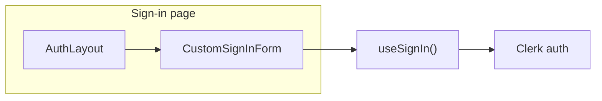

# Custom Personal / Institution Sign-In UI

## Current state

- **Sign-in page:** [app/sign-in/[[...sign-in]]/page.tsx](app/sign-in/[[...sign-in]]/page.tsx) uses [AuthLayout](components/auth-layout.tsx) and Clerk’s `<SignIn />`. AuthLayout already has Personal/Institution tabs, but they don’t affect the single Clerk form below.
- **Unused custom UI:** [components/sign-in-screen.tsx](components/sign-in-screen.tsx) has the desired layout (tabs, email/password, social) but is not used and the form is not wired to Clerk.
- **Stack:** Next 16, `@clerk/nextjs` v7, existing design tokens in [app/globals.css](app/globals.css) (e.g. `--accent`, `--border`, `--card`).

## Target architecture

- **AuthLayout:** Keep as-is (left 40% form column, right 60% quote carousel, logo, footer). Remove the non-functional Personal/Institution tabs from AuthLayout so the only tabs live in the custom form.
- **Custom form:** New client component with Personal/Institution tabs, email/password fields, “Forgot password?” link, primary “Sign In” button, “or continue with” divider, and Google/Apple buttons. Styled with your existing classes (`border-border`, `bg-card`, `text-foreground`, `focus:ring-ring`, etc.).
- **Clerk:** Use `useSignIn()` from `@clerk/nextjs` to call `signIn.password({ emailAddress, password })` on submit; on `signIn.status === 'complete'` call `signIn.finalize({ navigate })` and redirect (e.g. to `/` or return URL). Social: use Clerk’s OAuth redirect (e.g. `signIn.authenticateWithRedirect`) for Google/Apple so the “login function” stays Clerk; no backend change.

## Implementation plan

### 1. Add a custom sign-in form component (modular, TypeScript strict)

- **New file:** `components/auth/custom-sign-in-form.tsx` (client component).
  - **State:** `loginType: "personal" | "institution"`, `email`, `password`, `showPassword`, and any error message from Clerk.
  - **UI:**
    - Tabs: “Personal” and “Institution (School)” — same pattern as in [components/sign-in-screen.tsx](components/sign-in-screen.tsx) (rounded border, `bg-muted` container, active `bg-card`).
    - Email input with Mail icon; placeholder can differ by tab (e.g. “Email address” vs “School email address”) for UX only; backend stays one Clerk strategy.
    - Password input with Lock + Eye/EyeOff; “Forgot password?” link (point to Clerk’s forgot-password flow or `#` for now).
    - Primary button “Sign In” (disabled when `fetchStatus === 'fetching'`).
    - Divider “or continue with”, then Google and Apple buttons that trigger Clerk OAuth redirect.
    - “Don’t have an account? Sign up” linking to `/sign-up`.
  - **Logic:** `onSubmit` → `signIn.password({ emailAddress, password })`; on error, set and show `errors` from `useSignIn()`; on `signIn.status === 'complete'` → `signIn.finalize({ navigate })` with `decorateUrl('/')` (or `redirectUrl` from query). Handle `needs_second_factor` / `needs_client_trust` in a minimal way (e.g. show a message or link to a simple code step) so the flow doesn’t break. Use strict types (e.g. `React.FormEvent`, typed `errors` from Clerk).
- **Optional:** Extract social buttons into `components/auth/social-auth-buttons.tsx` and pass a callback that calls `signIn.authenticateWithRedirect` for the chosen provider (clean and modular).

### 2. Refactor AuthLayout so it only provides layout (no duplicate tabs)

- In [components/auth-layout.tsx](components/auth-layout.tsx), remove the Personal/Institution tab block (lines 104–117). Keep title, subtitle, and `{children}` so the sign-in page injects the custom form (which has its own tabs). No other layout change.

### 3. Wire the sign-in page to the custom form

- In [app/sign-in/[[...sign-in]]/page.tsx](app/sign-in/[[...sign-in]]/page.tsx):
  - Remove the `<SignIn />` import and usage.
  - Import and render the new custom sign-in form component inside `AuthLayout` with the same `title`/`subtitle` (“Welcome back”, “Sign in to access your creative vault.”).
  - Page can remain a server component; the custom form is a client component that uses `useSignIn()`.

### 4. Optional: Reuse or retire SignInScreen

- [components/sign-in-screen.tsx](components/sign-in-screen.tsx) is currently unused. Either (a) delete it and rely on the new `components/auth/custom-sign-in-form.tsx`, or (b) refactor so the sign-in page uses a single source of truth (e.g. move shared UI into the new form and remove SignInScreen). Recommendation: implement the new form under `components/auth/` and remove or repurpose SignInScreen to avoid two UIs.

### 5. Environment variables (reference .env.local)

- Your app already uses Clerk; ensure [.env.local](.env.local) (or equivalent) contains:
  - `NEXT_PUBLIC_CLERK_PUBLISHABLE_KEY`
  - `CLERK_SECRET_KEY`
  - For webhooks (e.g. user sync): `CLERK_WEBHOOK_SECRET` (only needed by API routes that verify webhook signatures; the sign-in UI does not read this).
- No code changes required in the sign-in page for these; ClerkProvider in [app/layout.tsx](app/layout.tsx) already uses the publishable/secret keys.

### 6. Clerk Dashboard settings to update

- **User & Authentication:** Enable “Sign in with email” and “Sign-up with email”; under Password, enable “Sign-up with password” and sign-in with password so `signIn.password()` works.
- **Email verification:** Leave as-is (e.g. “Verify at sign-up” with email code); if you add a verification step in the custom UI later, use the same strategy (e.g. `signUp.verifications.sendEmailCode` / `verifyEmailCode`).
- **Social connections:** Enable Google and Apple (or the ones you use) so “Continue with Google/Apple” uses Clerk’s OAuth.
- **Paths / Redirects:** Set sign-in redirect URL (e.g. after login send users to `/` or `/admin`); set allowed redirect URLs for your domain so `decorateUrl('/')` (or custom return URL) is allowed.
- **Customization (optional):** If later you want to distinguish Personal vs Institution in Clerk (e.g. public metadata or separate applications), you can add that; for “UI only first” the tabs can remain visual only and both use the same Clerk sign-in.

## File summary

| Action                   | File                                                                               |
| ------------------------ | ---------------------------------------------------------------------------------- |
| Create                   | `components/auth/custom-sign-in-form.tsx` — custom form + tabs + useSignIn wiring  |
| Optional create          | `components/auth/social-auth-buttons.tsx` — Google/Apple OAuth buttons             |
| Edit                     | `components/auth-layout.tsx` — remove duplicate Personal/Institution tabs          |
| Edit                     | `app/sign-in/[[...sign-in]]/page.tsx` — render custom form instead of `<SignIn />` |
| Optional delete/refactor | `components/sign-in-screen.tsx` — avoid duplicate UI                               |

## TypeScript and style

- Use strict types: explicit props and state types, Clerk `errors`/`fetchStatus` from `useSignIn()`.
- Reuse existing design: `cn()`, Tailwind theme from globals (e.g. `border-border`, `bg-card`, `text-foreground`, `ring-ring`, `accent`), same input height (`h-11`) and rounded borders as in your admin and sign-in-screen.
- Follow Clerk v7: `useSignIn()`, `signIn.password()`, `signIn.finalize({ navigate })`, and OAuth via `signIn.authenticateWithRedirect` where applicable.

This keeps the current login function (Clerk only), replaces the prebuilt UI with your custom Personal/Institution UI, and leaves a single place to add later logic (e.g. passing `loginType` to metadata or different redirects).